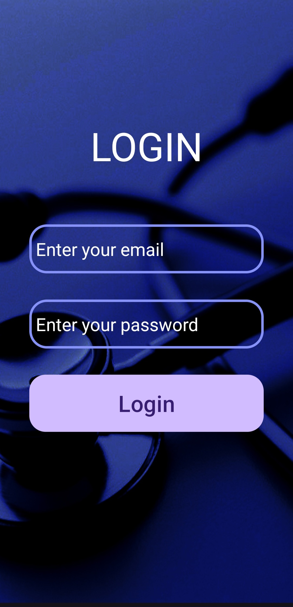
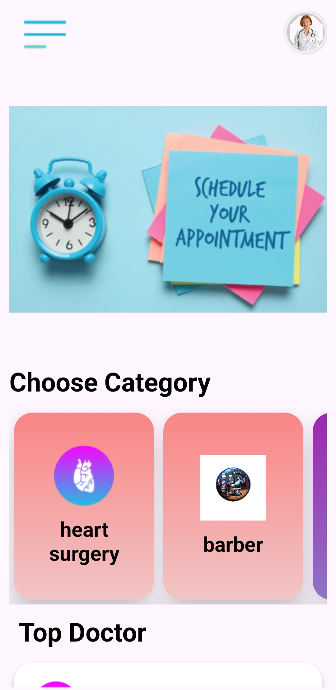

# 📅 Appointment Booking System for Salon and Doctors

This project is an **Appointment Booking System** developed for **Salons and Doctors**. The app allows users to **book appointments** based on available time slots. It is built with **Android Studio (Java)** for the front-end and **Firebase** for the back-end, ensuring real-time updates and smooth data management.

---
## ✨ Features

### 🏢 Salon Module
✅ **View Available Slots** - Browse time slots for different salon services.  
✅ **Book Appointments** - Schedule appointments for various salon services.  
✅ **Manage Appointments** - View and cancel existing appointments.  
✅ **Salon Profile** - View salon details, including name, location, and services.

### 🏥 Doctor Module
✅ **View Available Slots** - Browse available time slots for doctor consultations.  
✅ **Book Appointments** - Schedule doctor consultations.  
✅ **Manage Appointments** - View and cancel existing doctor appointments.  
✅ **Doctor Profile** - View doctor details such as specialization, clinic address, and consultation hours.

### 🛠 Admin Panel
✅ **Manage Appointments** - View and control all appointments.  
✅ **Manage Users and Providers** - Add, remove, or update doctor and salon profiles.  
✅ **Real-time Updates** - Firebase enables instant updates and notifications.

---
## 🏗 Technologies Used

🔹 **Frontend**: Android Studio (Java)  
🔹 **Backend**: Firebase (Firestore, Authentication, Realtime Database, Cloud Messaging)  
🔹 **Database**: Firebase Firestore (for appointments, user profiles, etc.)  
🔹 **Authentication**: Firebase Authentication (for user login & signup)  
🔹 **Push Notifications**: Firebase Cloud Messaging (for reminders & updates)  

---
## 📌 Prerequisites

- **Android Studio** installed on your system.
- **Firebase Account** to connect with Firestore, Authentication, and Cloud Messaging.
- **API Key for Firebase** - Set up Firebase in the project and configure the `google-services.json` file.

---
## 🚀 Setting Up the Project

### 1️⃣ Clone the Repository
```bash
git clone https://github.com/your-username/appointment-booking-system.git
cd appointment-booking-system
```

### 2️⃣ Set Up Firebase
- Go to the **[Firebase Console](https://console.firebase.google.com/)**.
- Create a new project and add Firebase to your Android project.
- Download `google-services.json` and place it in the `/app` directory.

### 3️⃣ Enable Firebase Services
- **Authentication** - Enable Firebase Authentication.
- **Firestore Database** - Set up Firestore for appointment and user data.
- **Cloud Messaging** - Enable Firebase Cloud Messaging for notifications.

### 4️⃣ Add Firebase Dependencies
Add these dependencies to your `build.gradle` files:
```gradle
// Project-level build.gradle
dependencies {
    classpath 'com.google.gms:google-services:4.3.10'
}
```
```gradle
// App-level build.gradle
apply plugin: 'com.google.gms.google-services'

dependencies {
    implementation 'com.google.firebase:firebase-auth:21.0.1'
    implementation 'com.google.firebase:firebase-firestore:24.0.3'
    implementation 'com.google.firebase:firebase-messaging:23.1.0'
    implementation 'com.google.firebase:firebase-analytics:20.0.3'
}
```
Sync Gradle to download the necessary dependencies.

---
## 🎯 How to Run the Project
1️⃣ Open the project in **Android Studio**.  
2️⃣ Ensure **Firebase** is configured correctly.  
3️⃣ Run the app on an **emulator or physical device**.  

---
## 📸 Screenshots

  
  
  
  
  

---
## 📂 Folder Structure
```
Appointment-Booking-System/
│
├── app/
│   ├── src/
│   │   ├── main/
│   │   │   ├── java/
│   │   │   │   ├── com/example/
│   │   │   │   │   ├── activities/        # Activities (Login, Dashboard, etc.)
│   │   │   │   │   ├── adapters/          # ListView, RecyclerView Adapters
│   │   │   │   │   ├── models/            # User, Appointment, Provider Models
│   │   │   │   │   ├── firebase/          # Firebase Helper Classes
│   │   │   │   │   ├── utils/             # Utility Functions
│   │   │   │   │   ├── notifications/     # Push Notification Handling
│   │   │   ├── res/
│   │   │   │   ├── layout/                # UI Layout Files
│   │   │   │   ├── values/                # Colors, Strings, Styles
├── google-services.json                   # Firebase Configuration
├── build.gradle                            # Gradle Configurations
```

---
## 🔥 Firebase Firestore Structure
### **Users Collection**
```json
{
  "userID": "abc123",
  "name": "John Doe",
  "email": "john@example.com",
  "role": "user",
  "appointments": []
}
```
### **Salons Collection**
```json
{
  "salonID": "salon456",
  "name": "Glam Salon",
  "location": "New York",
  "services": ["Haircut", "Makeup"],
  "availableSlots": ["10:00 AM", "2:00 PM"]
}
```
### **Doctors Collection**
```json
{
  "doctorID": "doc789",
  "name": "Dr. Smith",
  "specialization": "Dermatology",
  "location": "LA Clinic",
  "availableSlots": ["11:00 AM", "4:00 PM"]
}
```

---
## 🔧 Troubleshooting
❗ **Authentication Error** - Ensure Firebase Authentication is enabled.  
❗ **Database Issues** - Verify Firestore collections are structured correctly.  
❗ **Push Notifications Not Working** - Check Firebase Cloud Messaging settings.  

---
## 📜 License
This project is licensed under the **MIT License** - see the `LICENSE` file for details.

---
## 🙌 Acknowledgments
❤️ **Firebase** - Real-time database & authentication.  
❤️ **Android Studio** - Development platform.  

---
🚀 Happy Coding! 🎉

